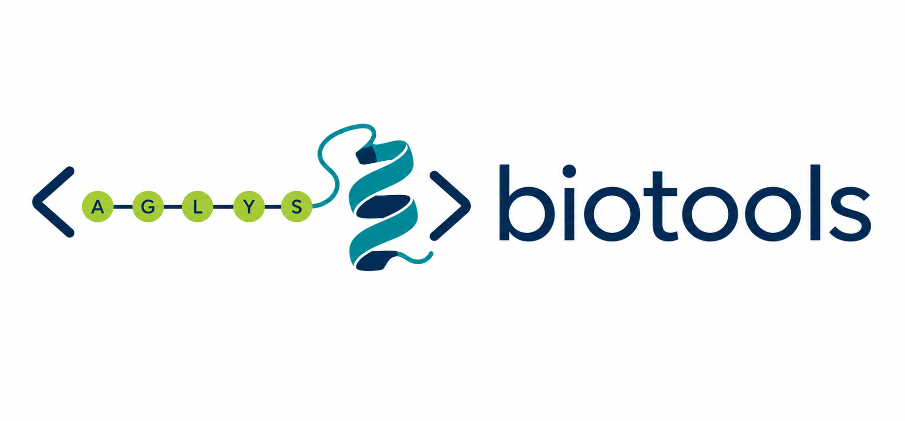

# biotools



`biotools` is a small Python toolkit for recurring structural-biology and
bioinformatics tasks. It combines sequence alignment and FASTA utilities with
helpers for downloading, inspecting, transforming, aligning, and visualizing
protein structures through Biopython.

The project is intended as a practical collection of reusable building blocks
for analysis scripts and notebooks rather than as a command-line application.

## Features

### Protein structures

The `biotools.pdbtools` module provides utilities to:

- download structures from the Protein Data Bank, with automatic PDB-to-mmCIF
  fallback;
- load and save PDB files and convert mmCIF structures to PDB;
- extract, rename, trim, and safely renumber chains and residues;
- obtain SEQRES records and amino-acid sequences;
- calculate RMSD and superimpose complete structures;
- align complete target structures from homologous chain correspondences;
- identify residue contacts between chains;
- center structures or orient them along their principal axes; and
- create interactive `py3Dmol` structure views.

Operations that rename chains or residues use collision-safe intermediate IDs,
including chain swaps such as `A -> B` and `B -> A`.

### Sequences

The `biotools.seqtools` module supports:

- global protein-sequence alignment using Biotite;
- alignment scores, identity, and similarity calculations;
- reading and writing simple FASTA files; and
- creating and searching local protein BLAST databases.

### Molecular dynamics

`biotools.mdtools` is reserved for OpenMM-based molecular-dynamics helpers and
is currently at an early stage of development.

## Requirements

- Python 3.12 or newer
- Biopython
- Biotite
- NumPy
- pandas
- py3Dmol

Local BLAST searches additionally require the NCBI BLAST+ executables
`makeblastdb` and `blastp` to be available on `PATH`. OpenMM is required only
when using `biotools.mdtools`.

## Installation

Clone the repository and install it in editable mode:

```bash
git clone <repository-url>
cd biotools
python -m pip install -e .
```

With [uv](https://docs.astral.sh/uv/), the project environment can instead be
created from the lockfile:

```bash
uv sync
```

## Quick start

### Download and inspect a structure

```python
from biotools.pdbtools import get_aa_sequence, get_pdb_structure

structure = get_pdb_structure("1crn", target_folder="structures")
sequences = get_aa_sequence(structure, show_gaps=False)

for chain_id, amino_acids in sequences.items():
    print(chain_id, amino_acids)
```

### Align a complete structure from homologous chains

```python
from biotools.pdbtools import align_homologs, load_pdb_from_file

reference = load_pdb_from_file("reference.pdb")
mobile = load_pdb_from_file("mobile.pdb")

# Chains A and B determine the transformation. The transformation itself is
# applied to a copy of the complete mobile structure.
aligned = align_homologs(reference, mobile, chain1="A", chain2="B")
```

### Safely rename and renumber chains

```python
from biotools.pdbtools import rename_chain, reset_index

# Simultaneous swaps and chained renames are handled without ID collisions.
rename_chain(structure, {"A": "B", "B": "A"})
reset_index(structure)
```

### Compare protein sequences

```python
from biotools.seqtools import (
    global_alignment_identity,
    global_alignment_seqs,
    global_alignment_similarity,
)

sequence_a = "MKTAYIAKQRQISFVKSHFSRQ"
sequence_b = "MKTAYIAKQRTISFVKSHFSRQ"

aligned_a, aligned_b = global_alignment_seqs(sequence_a, sequence_b)
identity = global_alignment_identity(sequence_a, sequence_b)
similarity = global_alignment_similarity(sequence_a, sequence_b)

print(aligned_a)
print(aligned_b)
print(f"Identity: {identity:.1f}%")
print(f"Similarity: {similarity:.1f}%")
```

### Search a local BLAST database

```python
from biotools.seqtools import BlastSearch

database = BlastSearch(
    input_fasta="proteins.fasta",
    db_name="proteins",
    description="Example protein database",
)
hits = database.search("query.fasta", evalue=1e-10, min_coverage=0.9)
print(hits)
```

## Logging

The library uses Python's standard `logging` package and does not configure
global handlers. Applications can opt into informational output themselves:

```python
import logging

logging.basicConfig(level=logging.INFO)
```

For more detailed diagnostics, set the level of an individual module logger:

```python
logging.getLogger("biotools.pdbtools").setLevel(logging.DEBUG)
```

## Development status

`biotools` is under active development. APIs may still evolve, and test
coverage is currently limited. Validate results carefully before using them in
production analysis pipelines.
