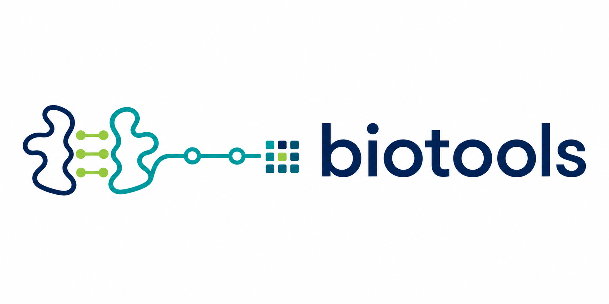

# biotools



`biotools` is a small Python toolkit for recurring structural-biology and
bioinformatics tasks. It provides reusable building blocks for analysis
scripts and notebooks rather than a command-line application.

## Modules

| Module | Summary | Documentation |
| --- | --- | --- |
| `biotools.structure` | Structure I/O, chain manipulation, alignment, geometric contacts, distance and interaction matrices, DSSP, FreeSASA, and visualization | [Structure guide](doc/structure/README.md) |
| `biotools.sequence` | Protein-sequence alignment, FASTA utilities, and local BLAST searches | [Sequence guide](doc/sequence/README.md) |
| `biotools.mdtools` | OpenMM-based structure preparation, minimization, equilibration, restart support, and diagnostic plots | [Molecular-dynamics guide](doc/md/README.md) |

The implementation is organized into focused submodules. The original
`biotools.pdbtools` and `biotools.seqtools` modules remain available as
backward-compatible import facades.

## Requirements

`biotools` requires Python 3.11 or newer. The base installation includes the
sequence and structure modules, NumPy, pandas, Matplotlib, Biopython, Biotite,
and py3Dmol.

Some workflows use separately installed command-line tools:

- local sequence searches require NCBI BLAST+ (`makeblastdb` and `blastp`);
- secondary-structure assignment requires DSSP (`dssp` or `mkdssp`); and
- solvent-accessibility analysis requires FreeSASA (`freesasa`).

See the module guides for workflow-specific requirements and examples.

## Installation

Clone the repository and install the base package in editable mode:

```bash
git clone <repository-url>
cd biotools
python -m pip install -e .
```

The base installation omits the molecular-dynamics dependencies and their
large CUDA packages. Geometric contact characterization uses built-in protein
bond templates by default.

Install the CPU-only OpenMM contact-topology backend with:

```bash
python -m pip install -e ".[contacts]"
```

Install the full molecular-dynamics feature set, including CUDA 12 support,
with:

```bash
python -m pip install -e ".[md]"
```

Extras can be combined:

```bash
python -m pip install -e ".[md,contacts]"
```

With [uv](https://docs.astral.sh/uv/), use the equivalent commands:

```bash
uv sync
uv sync --extra contacts
uv sync --extra md
uv sync --extra md --extra contacts
```

## Logging

The library uses Python's standard `logging` package and does not configure
global handlers. Functions with a `verbose` argument log progress by default;
pass `verbose=False` to suppress it. Applications can display informational
messages with:

```python
import logging

logging.basicConfig(level=logging.INFO)
```

## Development status

`biotools` is under active development. APIs may still evolve. Validate
results carefully before using them in production analysis pipelines.
